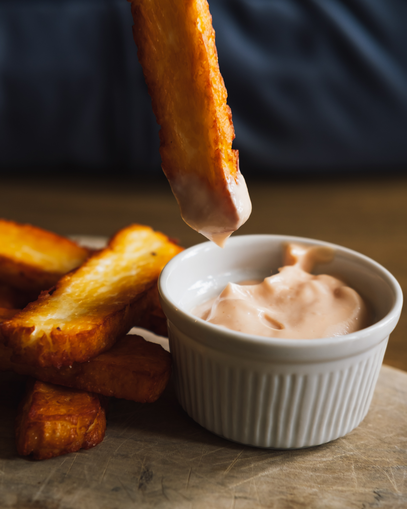

#Menu

##Pizza klasyczna
|Lp.| Nazwa pizzy:                                                                                       | 30cm| 50cm| 60cm|
|---|----------------------------------------------------------------------------------------------------|-----|-----|-----|
|1. | Margherita - Sos pomidorowy, mozzarella                                                            | 25zł| 28zł| 31zł|
|2. | Capricciosa - Sos pomidorowy, mozzarella, pieczarki, szynka                                        | 32zł| 35zł| 38zł| 
|3. | Prosciutto - Sos pomidorowy, mozzarella, szynka                                                    | 30zł| 33zł| 36zł|
|4. | Diavola - Sos pomidorowy, mozzarella, pikantna salami                                              | 35zł| 38zł| 41zł|
|5. | Quattro formaggi - Sos pomidorowy, mozzarella, ser gorgonzola, ser pleśniowy, ser parmezan         | 40zł| 43zł| 46zł|
|6. | Calzone - Sos pomidorowy, mozzarella, szynka, pieczarki, cebula, jajko                             | 42zł| 45zł| 48zł|
|7. | Hawajska - Sos pomidorowy, mozzarella, szynka, ananas                                              | 33zł| 36zł| 39zł|
|8. | Frutti di Mare - Sos pomidorowy, mozzarella, owoce morza                                           | 45zł| 48zł| 51zł|
|9. | Salami - Sos pomidorowy, mozzarella, salami, papryka, cebula                                       | 36zł| 39zł| 42zł|

##Pizza wegetariańska

|Lp.| Nazwa pizzy:                                                                                       | 30cm| 50cm| 60cm|
|---|----------------------------------------------------------------------------------------------------|-----|-----|-----|
|1. | Vegetariana - Sos pomidorowy, mozzarella, papryka, cebula, bakłażan, pieczarki, oliwki             | 38zł| 41zł| 44zł|
|2. | Marinara - Sos pomidorowy, czosnek, oregano                                                        | 25zł| 28zł| 31zł| 
|3. | Caprese - Sos pomidorowy, mozzarella, pomidory, bazyliowy pesto                                    | 35zł| 38zł| 41zł|
|4. | Quattro stagioni - Sos pomidorowy, mozzarella, pieczarki, karczochy, szpinak, oliwki               | 42zł| 45zł| 48zł|
|5. | Ortolana - Sos pomidorowy, mozzarella, cukinia, bakłażan, papryka, cebula, szpinak                 | 40zł| 43zł| 46zł|

##Pizza faszerowana

|Lp.| Nazwa pizzy:                                                                                       | 30cm| 50cm| 60cm|
|---|----------------------------------------------------------------------------------------------------|-----|-----|-----|
|1. | Calzone - Sos pomidorowy, mozzarella, szynka, pieczarki, cebula, jajko, **zamykana w półksiężyc**  | 42zł| 45zł| 48zł|
|2. | Faszerowana z szynką i serem - Sos pomidorowy, mozzarella, szynka, ser, **zamykana w pieróg**      | 38zł| 41zł| 44zł| 
|3. | Faszerowana z warzywami - Sos pomidorowy, mozzarella, pieczarki, cebula, papryka, bakłażan, oliwki, **zamykana w pieróg** | 30zł| 33zł| 36zł|
|4. | Faszerowana z kiełbasą chorizo - Sos pomidorowy, mozzarella, chorizo, cebula, **zamykana w pieróg**| 35zł| 38zł| 41zł|

##Makarony

|Lp.| Nazwa dania:                                                                                       | 1 porcja| 1,5 porcji| podwójna|
|---|----------------------------------------------------------------------------------------------------|---------|-----------|---------|
|1. | Spaghetti Bolognese - Makaron spaghetti z sosem mięsnym i parmezanem                               | 29zł    |       32zł|     35zł|
|2. | Penne Arrabiata - Makaron penne z ostrym sosem pomidorowym i bazylią                               | 32zł    |       35zł|     38zł|
|3. | Lasagne - Warstwy makaronu z mięsem, sosem beszamelowym i pomidorowym, posypane parmezanem         | 35zł    |       38zł|     41zł|
|4. | Tagliatelle z kurczakiem i szpinakiem - Makaron tagliatelle z kurczakiem, szpinakiem i sosem śmietanowym | 38zł    |       41zł|     44zł|

##Sałatki

|Lp.| Nazwa pizzy:                                                                                       | 30cm|
|---|----------------------------------------------------------------------------------------------------|-----|
|1. | Caprese - Pomidory, mozzarella, rukola, bazyliowy pesto                                            | 20zł|
|2. | Grecka - Sałata mix, pomidory, ogórki, cebula, feta, oliwki, dressing cytrynowy                    | 22zł|
|3. | Ceasar - Sałata mix, kurczak, grzanki, parmezan, dressing cezar                                    | 25zł|
|4. | Z tuńczykiem - Sałata mix, tuńczyk, cebula, kukurydza, jajko, sos winegret                         | 28zł|
|5. | Meksykańska - Sałata mix, fasola, kukurydza, cebula, papryka, chilli, dressing jogurtowo-paprykowy | 31zł|

##Sosy

1. Sos majonezowy - 5 zł
2. Sos czosnkowy - 5 zł
3. Sos barbecue - 5 zł
4. Sos czterech serów - 8 zł
5. Sos barbecue - 7 zł

##Napoje

|Lp.| Nazwa:                                    | 330ml   | 500ml     |
|---|-------------------------------------------|---------|-----------|
|1. | Coca - Cola                               |  7zł    |        9zł|
|2. | Sprite                                    |  7zł    |        9zł|
|3. | Fanta                                     |  7zł    |        9zł|
|4. | Woda niegazowana                          |  6zł    |        8zł|
|5. | Woda gazowana                             |  6zł    |        8zł|
|6. | Piwo jasne                                | 12zł    |       16zł|
|6. | Piwo ciemne                               | 12zł    |       16zł|
